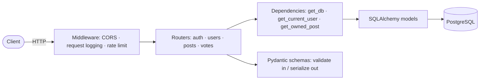

# Social Feed API

A small Reddit-style social feed, built as a backend-engineering learning project.
Users register, log in with a JWT, publish posts, and upvote each other's posts.
The feed itself is public; writing requires a token.

Started from the freeCodeCamp *Python API Development* course, then modernised and
hardened step by step (SQLAlchemy 2.0, Pydantic v2, PyJWT, rate limiting, structured
logging, pagination, CI/CD).

## Stack

| Concern        | Choice                                             |
| -------------- | -------------------------------------------------- |
| Web framework  | FastAPI (Starlette + Pydantic v2)                  |
| Database       | PostgreSQL 17                                      |
| ORM            | SQLAlchemy 2.0 (`Mapped` / `select()` style)       |
| Migrations     | Alembic                                            |
| Auth           | OAuth2 password flow, JWT (PyJWT, HS256), bcrypt   |
| Rate limiting  | slowapi                                            |
| Tests          | pytest + Starlette `TestClient`                    |
| Packaging      | Docker (python:3.14-slim), Docker Compose          |
| CI/CD          | GitHub Actions → Docker Hub                        |

## Architecture



A request flows: **middleware → router → dependencies (DB session, auth, ownership)
→ SQLAlchemy → PostgreSQL**, with Pydantic schemas validating the request body and
shaping the response.

## Project layout

```
backend/
  app/
    main.py            app factory, middleware, exception handlers, /healthz
    config.py          env-driven settings (pydantic-settings)
    database.py        engine + pooled session, get_db dependency
    models.py          ORM tables: Post, User, Vote
    schemas.py         request/response models
    oauth2.py          JWT create/verify, get_current_user
    limiter.py         shared slowapi limiter
    logging_config.py  dictConfig setup
    routers/           auth.py · user.py · post.py · vote.py
  alembic/             migrations
  tests/               pytest suite + fixtures
frontend/              web UI — plain HTML/CSS/JS, no build step (see frontend/README.md)
docker-compose.yml       local dev stack (api + postgres)
docker-compose.prod.yml  prod-like stack (migrate + api + postgres)
```

## Running locally

### Option A — Docker (nothing to install but Docker)

```bash
cp backend/.env.example .env      # then edit values
docker compose up --build
```

API on <http://localhost:8000>, interactive docs on <http://localhost:8000/docs>.

### The web UI

```bash
cd frontend && python3 -m http.server 5173
```

Then open <http://localhost:5173> (the origin the API's CORS config allows). It's
plain HTML/CSS/JS with no build step. Details, design tokens, and how to run its
tests are in [`frontend/README.md`](frontend/README.md).

### Option B — local Python + your own Postgres

```bash
python -m venv .venv && source .venv/bin/activate
pip install -r backend/requirements-dev.txt
cp backend/.env.example .env      # point it at your Postgres

# create the databases your config names (e.g. social_feed + social_feed_test)
alembic -c backend/alembic.ini upgrade head
uvicorn backend.app.main:app --reload
```

## Tests

```bash
cd backend && pytest -q
```

Needs a reachable Postgres and a `<DATABASE_NAME>_test` database (the suite creates
and drops the tables itself on every test).

The frontend has its own Playwright end-to-end suite (`cd frontend && npm test`)
that runs against a stdlib mock of this API — no Postgres needed. See
[`frontend/README.md`](frontend/README.md).

## Migrations

```bash
# from the repo root
alembic -c backend/alembic.ini revision -m "describe change"   # after editing models.py
alembic -c backend/alembic.ini upgrade head
alembic -c backend/alembic.ini downgrade -1
```

## API overview

| Method   | Path            | Auth      | Notes                                    |
| -------- | --------------- | --------- | ---------------------------------------- |
| `POST`   | `/users/`       | –         | register (password 8–72 bytes)           |
| `POST`   | `/login`        | –         | form login → `{access_token}`, 5/min     |
| `GET`    | `/posts/`       | –         | paginated feed: `?page=&page_size=&search=` |
| `GET`    | `/posts/{id}`   | –         | one post + vote count                    |
| `POST`   | `/posts/`       | bearer    | create                                   |
| `PUT`    | `/posts/{id}`   | bearer    | full replace (author only)               |
| `PATCH`  | `/posts/{id}`   | bearer    | partial update (author only)             |
| `DELETE` | `/posts/{id}`   | bearer    | author only                              |
| `POST`   | `/vote/`        | bearer    | `{post_id, dir}` — `dir` 1 = up, 0 = remove |
| `GET`    | `/healthz`      | –         | liveness probe                           |

## Roadmap

- [x] Modernise to SQLAlchemy 2.0 / Pydantic v2 / PyJWT
- [x] 401 vs 403, password rules, structured logging, global error handler
- [x] Rate limiting, DB connection pool, `/healthz`
- [x] Flat post schema, N+1 fix, public feed, pagination metadata, `PATCH` + `updated_at`
- [x] Split CI (test vs publish), migrations checked in CI, slim non-root image
- [x] Frontend — plain HTML/CSS/vanilla JS, no build step ([`frontend/`](frontend/))
- [ ] User profiles, comments, follows, refresh tokens
