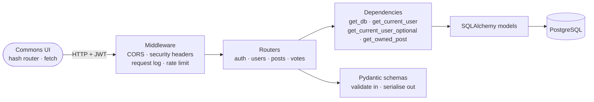

<h1 align="center">Commons</h1>

<p align="center">
  A small public common. Anyone can read the feed; you need an account to post or upvote.
</p>

<p align="center">
  <a href="https://andrewtechtips.github.io/social-feed-application/"><strong>Live demo</strong></a>
  ·
  <a href="#running-it">Run it locally</a>
  ·
  <a href="#decisions-i-made">Decisions I made</a>
</p>

<p align="center">
  <a href="https://github.com/AndrewTechTips/social-feed-application/actions/workflows/build-deploy.yml">
    
  </a>
  
  <a href="LICENSE"></a>
</p>

<p align="center">
  
</p>

A full-stack social feed: **FastAPI + PostgreSQL** behind a **hand-written, no-build
frontend**. Register, publish posts, upvote other people's, search and page through the
feed. Reading is public; writing needs a token.

| | |
| --- | --- |
| **Backend** | FastAPI · SQLAlchemy 2.0 · PostgreSQL 17 · Alembic · JWT + bcrypt · slowapi |
| **Frontend** | Plain HTML, CSS and ES modules. No framework, no bundler, no build step. |
| **Tested** | 76 pytest tests (94% coverage) · 151 Playwright end-to-end tests, run against two API implementations |
| **Shipped** | Docker · GitHub Actions → Docker Hub |

---

## A look at it

<p align="center">
  
</p>

<table>
<tr>
<td width="50%"><br /><sub>Post detail — content is set in a serif, the interface isn't.</sub></td>
<td width="50%"><br /><sub>Compose, with the publish toggle and a character count.</sub></td>
</tr>
<tr>
<td><br /><sub>Light theme — a cool off-white, never cream.</sub></td>
<td align="center"><br /><sub>390px. The header collapses to two rows.</sub></td>
</tr>
</table>

<sub>Every image here is a real capture of the running app —
see <a href="docs/README-capture.md">docs/README-capture.md</a> to regenerate them.</sub>

---

## About that live demo

The link at the top is hosted on GitHub Pages, which serves static files and
nothing else — there is nowhere for FastAPI to run. So rather than publish a link
that opens on *"Can't reach the server"*, the published build answers its own
requests: [`frontend/js/demo/backend.js`](frontend/js/demo/backend.js)
reimplements the API in the browser, against
[a seeded feed](frontend/js/demo/seed.json) of real posts. It says so on the
page, and it says so on every visit.

Everything works — post, upvote, edit, delete, search, paginate, drafts staying
private. Changes are kept in `localStorage`, so they survive a refresh and reach
nobody else; **Reset the demo** puts it back.

What makes it more than a mock: the end-to-end suite runs **the same 42 specs
against both** the demo adapter and `mock_api.py`, so the site people click and
the API this project ships can't quietly drift apart. `?demo=1` turns it on
locally against the real files:

```bash
cd frontend && python3 -m http.server 5173
open "http://localhost:5173/?demo=1"
```

---

## Running it

### Docker — nothing to install but Docker

```bash
cp backend/.env.example .env      # then edit the values
docker compose up --build
```

API on <http://localhost:8000>, interactive docs on <http://localhost:8000/docs>.

### Or locally, with your own Postgres

```bash
python -m venv .venv && source .venv/bin/activate
pip install -r backend/requirements-dev.txt
cp backend/.env.example .env      # point it at your Postgres

# create the databases your config names (e.g. social_feed + social_feed_test)
alembic -c backend/alembic.ini upgrade head
uvicorn backend.app.main:app --reload
```

### The web UI

```bash
cd frontend && python3 -m http.server 5173
```

Open <http://localhost:5173> — the origin the API's CORS config allows. That's the whole
build step. `API_BASE` lives in `frontend/js/config.js`; if you serve the app somewhere
else, add that exact origin to `origins` in `backend/app/main.py`.

---

## How it fits together



A request goes **middleware → router → dependencies (session, auth, ownership) →
SQLAlchemy → PostgreSQL**, with Pydantic validating the body on the way in and shaping
the response on the way out.

```
backend/
  app/
    main.py            app setup, middleware, exception handlers, /healthz
    config.py          env-driven settings (pydantic-settings)
    database.py        engine + pooled session, get_db dependency
    models.py          ORM tables: Post, User, Vote
    schemas.py         request/response models
    oauth2.py          JWT create/verify, get_current_user(_optional)
    limiter.py         shared slowapi limiter
    logging_config.py  dictConfig setup
    routers/           auth.py · user.py · post.py · vote.py
  alembic/             migrations
  tests/               pytest suite + fixtures
  scripts/             coverage_badge.py
frontend/
  index.html           shell: header, <main> mount, aria-live toasts, theme bootstrap
  styles/              tokens.css · base.css · components.css · views.css
  js/
    config.js          picks the API: the real one, or the in-browser demo
    api.js             fetch wrapper — auth header, JSON, error normalisation, 401/403/429
    store.js           tiny reactive store: session, feed cache, local vote mirror
    router.js          hash router with :params and a ?query
    ui.js              h() builder, toasts, relative time, avatars, skeletons, vote control
    views/             feed.js · post.js · auth.js · compose.js
    components/        palette.js — the ⌘K command palette
    actions.js         the few things both the header and the palette can do
    transitions.js     the card-title → post-title view transition
    demo/              backend.js (the API, in the browser) · seed.json · strip.js
    main.js            boot: header, theme toggle, search wiring, routes
  assets/              one subset variable font, one SVG icon sprite
  tests/               Playwright specs, a stdlib mock backend, and the fixtures
                       that point the suite at either API
docs/                  screenshots, and the scripts that regenerate them
```

### Screens

One page, hash routes.

| Route | Screen |
| --- | --- |
| `#/` | Feed (public). Opens with a masthead for anyone not signed in — a line of type saying what this is, and in demo mode the notice too. Debounced title search drives `?search=`; infinite scroll with a visible end state; skeletons while loading. |
| `#/posts/:id` | Post detail (public). Full text, timestamps, "edited" when changed, vote control, Edit/Delete if it's yours with an inline confirm. |
| `#/login`, `#/register` | Inline field errors, one friendly line on failure, submit disabled while pending. Register signs you in, so you land on the feed ready to post. |
| `#/compose`, `#/posts/:id/edit` | Title, body, publish toggle, character count. `POST` to create; `PATCH` with only the changed fields to edit. |

### The API

| Method | Path | Auth | Notes |
| --- | --- | --- | --- |
| `POST` | `/users/` | – | register (password 8–72 bytes), 10/hour |
| `POST` | `/login` | – | form login → `{access_token}`, 5/min |
| `GET` | `/posts/` | optional | paginated feed: `?page=&page_size=&search=` — drafts only if they're yours |
| `GET` | `/posts/{id}` | optional | one post + vote count |
| `POST` | `/posts/` | bearer | create |
| `PUT` | `/posts/{id}` | bearer | full replace (author only) |
| `PATCH` | `/posts/{id}` | bearer | partial update (author only) |
| `DELETE` | `/posts/{id}` | bearer | author only |
| `POST` | `/vote/` | bearer | `{post_id, dir}` — `dir` 1 = up, 0 = remove |
| `GET` | `/healthz` | – | liveness probe |

---

## Tests

```bash
cd backend && pytest -q          # 76 tests, coverage gate at 85%
cd frontend && npm test          # 151 Playwright tests, no Postgres needed
```

The backend suite needs a reachable Postgres and a `<DATABASE_NAME>_test` database; it
creates and drops the tables itself on every test.

The frontend suite runs twice, against both implementations of the API: the
standard-library `frontend/tests/mock_api.py`, and the in-browser adapter the
published site uses. Neither needs Postgres, so it's hermetic and fast. First
time:

```bash
cd frontend && npm install && npx playwright install chromium
```

| Spec | Covers |
| --- | --- |
| `e2e.spec.js` | The whole journey: register → sign in → create → upvote and un-upvote → edit → delete (inline confirm, Escape to cancel) → sign out. Plus pagination on scroll and search. |
| `drafts.spec.js` | A draft is visible to its author and to nobody else, in the feed and by direct URL, and publishing puts it back in everyone's feed. |
| `errors.spec.js` | Wrong password, duplicate email, editing someone else's post, empty fields, backend unreachable. |
| `responsive.spec.js` | No horizontal overflow at 320–1280, the header collapse, ≥44px tap targets, the reading column staying narrow. |
| `palette.spec.js` | ⌘K: one flat list, a key on every row, filtering the loaded feed without touching the network, each of the five actions, and the shortcuts working outside the palette but staying out of the way while you type. |
| `transitions.spec.js` | The title morph both ways, the name being released afterwards, reduced motion starting no transition at all, a browser without the API still navigating, and the per-card stagger staying gone. |
| `masthead.spec.js` | Shown to strangers, gone once signed in, out of the way while searching, and — in demo mode — carrying the notice so it's said once rather than twice. |
| `demo-seed.spec.js` | Demo mode only: the published site opens on the seeded feed, paginates to the end, says what it is on every visit, keeps a seeded draft private to its author, and survives a refresh — then forgets everything on **Reset the demo**. |
| `mobile.spec.js` | The phone-only regressions: transparent tap highlight, ≥16px form controls at every width *and* in landscape, `:active` feedback under a real tap gesture, hover states behind `(hover: hover)`, no overflow at 320–414 while signed in, and source guards against bare `100vh` coming back. |

CI runs both suites on every push, checks `black`, verifies the migrations apply to an
empty database *and* still match the models (`alembic check`), and only publishes an
image once all of that is green.

> **If port 8000 is busy** (the real backend is running, say): point the app at a free
> port by editing `js/config.js`, then `API_PORT=8010 npm test` to match.

---

## Decisions I made

**Drafts are an access rule, not a display hint.** The feed used to filter on the search
term and nothing else, which meant an unpublished post was served to everybody while the
UI cheerfully labelled it "Draft". `GET /posts/` and `GET /posts/{id}` now apply
"published, or yours", via an *optional* auth dependency — the feed has to stay readable
without a token, so a bad token makes you anonymous rather than making the page a 401.
Someone else's draft answers 404, not 403: a 403 would confirm it exists.

**Login takes the same time whether or not the email exists.** A missing user used to
return before any hashing happened, while a wrong password paid for a full bcrypt round —
about 100 ms of difference that told you which addresses had accounts, whatever the
response body said. The miss path now verifies against a fixed dummy hash.

**The database has indexes that match the one hot query.** The feed filters on
`published` and sorts by `created_at`, so those share a composite index and the planner
does an index scan backwards instead of sorting the table. Counting votes per post gets
its own index, because the `votes` primary key leads with `user_id` and can't answer that
question.

**One font, split by job.** Newsreader — a subset variable woff2, ~120 KB, preloaded —
carries every piece of *content*. The interface chrome uses the system sans stack. That
split is the identity: a quiet lamplit reading room, not a dashboard.

**The title travels.** Tap a post and its heading moves from the card to the top of
the screen, rather than one screen fading into another — the same idea as an iOS push,
or Things 3, where the thing you touched becomes the thing you're looking at. It's built
on the View Transitions API, feature-detected, and it replaced a staggered fade-up that
played on every card: that fired on pagination and on cache restore too, where nothing
had actually arrived. Motion should answer an action, not perform on arrival.

It's kept short (160ms for the page, 240ms for the title) for a reason that isn't
taste — while a view transition runs, the browser shows snapshots and the document
doesn't take input. The duration is also how long the app ignores a tap.

**The vote is the only other thing that pops.** One spring, one colour shift, and a shape
change (outline caret → filled) so it never depends on colour alone. Everything else
stays still.

**⌘K opens a command palette.** One flat list — Raycast's discipline, no categories — and
every row shows the key that runs it, which is Linear's habit and the reason the palette
makes itself unnecessary. That only works if the keys are real, so `N`, `T`, `G` and `C`
work on their own outside it. It searches the posts already on screen, so filtering never
touches the network, and it does five things and stops.

**Optimistic voting, pessimistic writes.** Votes update immediately and roll back on a
real error; 409 and 404 are treated as "you're already in the state you wanted". Create,
edit and delete wait for the server.

**The feed cache is keyed on who it was fetched for.** Leaving the feed snapshots its
items and scroll position for 60 seconds so coming back is instant. Because you see your
own drafts and nobody else does, that snapshot records the viewer it was fetched *for* —
otherwise signing out re-renders the same route, and the outgoing screen's teardown
writes the signed-in list back into the cache one line before it's read.

**The token is in `localStorage`, and that has a cost.** An XSS bug would leak it. The
alternative — an httpOnly cookie — needs a refresh-token flow and CSRF protection that
aren't built yet. It's a real tradeoff, not an oversight, and it's the next thing on the
list.

**Signup tells you an email is taken.** That does let someone enumerate addresses. The
usual fix is to answer 201 either way and send the "you already have an account" note by
email, which needs mail this project doesn't have; the 10/hour limit is the compensating
control.

**No "did I vote" flag in the API**, so the vote control keeps a best-effort mirror in
`localStorage`. If it disagrees with the server, the vote call returns 409 or 404 and the
control settles into the real state.

<details>
<summary><strong>The design system, in full</strong></summary>

Everything lives in `frontend/styles/tokens.css` as custom properties.

| Group | Values |
| --- | --- |
| **Type** | `--font-serif` Newsreader (variable, opsz 6–72) for brand, titles, post body, headings, empty states. `--font-ui` system sans for everything interactive. Scale: `--fs-brand` 1.15rem · `--fs-h1` clamp(1.7→2.4rem) · `--fs-title` 1.3rem · `--fs-read` 1.125rem · `--fs-ui` .875rem · `--fs-meta` .8125rem. Reading measure `--measure: 66ch`. Form controls use `--fs-field`, which is `--fs-ui` on the desktop and exactly 16px on anything touch-shaped. |
| **Colour (dark)** | `--bg #0c1315` deep teal-ink · `--card-bg` translucent `#131d20` · `--text #e7edec` / `--text-dim #93a3a1` / `--text-faint #7c8b87` · one accent, `--accent #f0a63c` honey amber, used only for live things (your identity, an active upvote, links) · `--danger #e8705d` coral · `--focus #7fd6c4` teal — deliberately *not* the accent, so focus always reads. |
| **Colour (light)** | Cool off-white `--bg #eef1f1` (not warm cream), `--accent #e2952f`, `--link #9a5f12`, `--focus #1f8a76`. The toggle persists to `commons.theme` and defaults to `prefers-color-scheme` via a pre-paint inline script. |
| **Space** | 8px rhythm: `--s-1`…`--s-9` = 4, 8, 12, 16, 24, 32, 48, 64, 96. |
| **Radius** | Varies by role on purpose: cards `--r-lg` 18px, inputs and buttons `--r-sm` 10px, pills 999px. |
| **Glass** | `--blur` 14px / `--blur-strong` 20px, `--saturate` 1.6, on four surfaces only: the header, the compose panel, the delete confirm, and a card on hover. Hairline gradient top border, soft large-radius shadow. `@supports not (backdrop-filter)` falls back to solid — and below 640px the blur is dropped entirely in favour of those same fallbacks. |
| **Motion** | `--t-fast/mid/slow` 120/200/320ms, `--ease` `cubic-bezier(.2,.7,.2,1)`. Two things move on purpose — the title travelling from card to post, and the spring pop on the vote. Everything else is feedback, not animation: hover lift, button press scale, skeleton shimmer, and a cross-fade for browsers without View Transitions. `transform` and `opacity` only. `prefers-reduced-motion` cuts all of it, the view transition included. |
| **Background** | Two slow, very faint amber and teal blooms behind everything. They never compete with text, shrink to one static bloom below 640px, and stop entirely under reduced motion. |

**Voice.** Understated and warm. Short sentences, contractions, no hype. *"Nothing here
yet. Be the first to say something."* / *"That's everything for now."* / *"Delete this
post? There's no undo."*

**Accessibility.** Semantic landmarks, labelled inputs, `aria-live` toasts, focus moves to
the new screen on route change (but not away from the search field while you're typing),
Escape closes the delete confirm and returns focus to the trigger, visible restyled focus
rings, AA contrast throughout.

**Icons** are an SVG `<use>` sprite, not a font — one cached request.

</details>

<details>
<summary><strong>What making it work on a phone actually took</strong></summary>

The layout was responsive from the start. These are the things that only showed up on a
real handset.

**The blue tap flash.** Nothing overrode `-webkit-tap-highlight-color`, so every tap on a
link, button or card flashed the browser default — `rgba(51, 181, 229, .4)` — over it.
It's now `transparent` on `html` (the property inherits, so that covers everything),
alongside `touch-action: manipulation` to drop the 300ms click delay.

Turning it off means the press feedback has to come from somewhere, and most of the
`:hover` rules were ungated: on a touch screen a tapped element keeps its hover skin until
you tap somewhere else. So every hover-only state now sits inside `@media (hover: hover)`,
and each tappable thing grew a matching `:active` rule. Worth knowing if you ever test
this by hand: `:active` is driven by the browser's *tap gesture*, not by raw touch events,
which is why `mobile.spec.js` drives it with `Input.synthesizeTapGesture` rather than a
synthetic `touchstart`.

**iOS zoom-on-focus.** `.input`, `.textarea` and `.search__input` were 14px. Below 16px,
mobile Safari zooms the page in when a field takes focus and never zooms back out — tap
the search box, lose the layout. Form controls now use `--fs-field`, which lifts to
exactly 16px under `@media (max-width: 640px), (pointer: coarse)`. Both halves earn their
keep: the width query covers narrow windows and device mode, and the pointer query covers
a phone in landscape, which is 900px+ wide on a modern handset and would sail straight
past a width-only rule.

**The signed-in header overflowed.** At 320px the labelled *Write* and *Sign out* buttons
pushed the theme toggle clean off the right edge, where it could not be tapped at all, and
took 49px of horizontal scroll with it. Below 640px both shed their words and become 44px
icon buttons — the accessible name comes from `aria-label`, so nothing is lost. The same
row broke again between about 640 and 900px: the header grid's middle track is now
`minmax(0, 1fr)` so the search yields instead of the row overflowing, and the account
email hides below 900px rather than 640px.

**Compose read as a squeezed desktop dialog.** On a phone it now drops the backdrop blur
and the 64px modal shadow, tightens its padding, and gives the body box
`max(9rem, 28dvh)` so there's somewhere to actually write.

**Glass was costing more than it was worth.** A `backdrop-filter` makes the browser
snapshot and blur everything behind the element on every frame it scrolls over; on a
weaker GPU that's what turns a sticky header into a smear. Below 640px the header, compose
panel and toasts use the opaque fallbacks that already existed for
`@supports not (backdrop-filter)`. The background blooms got the same treatment.

**Viewport and insets.** `viewport-fit=cover` was set, which means the page paints under
the status bar and home indicator — but nothing inset for them. The sticky header now pads
by `env(safe-area-inset-top)` and `#view` by `env(safe-area-inset-bottom)`. The header's
left/right insets were also transposed and are now the right way round. Heights that mean
"the visible viewport" use `dvh`, so nothing jumps as the URL bar slides in and out.

**Tap targets.** The brand, the *Back to the feed* link, the password reveal and the quiet
buttons were between 26 and 40px tall. They're 44px on a phone.

</details>

<details>
<summary><strong>Performance</strong></summary>

Lighthouse (mobile, throttled, against the mock backend): **96–98** performance,
**100** accessibility, **100** best practices.

No layout shift — skeletons match their final sizes, and off-screen cards use
`content-visibility` with a reserved `contain-intrinsic-size`. One preloaded font file,
no polling, no console output. Search debounced ~250ms with in-flight requests cancelled
through `AbortController`. Feed pages are appended with a `DocumentFragment`, never
rebuilt. About 41 KB of hand-written JS across 10 ES modules (~12 KB gzipped) and ~35 KB
of CSS, unminified — the comments stay.

</details>

---

## Migrations

```bash
# from the repo root
alembic -c backend/alembic.ini revision -m "describe change"   # after editing models.py
alembic -c backend/alembic.ini upgrade head
alembic -c backend/alembic.ini downgrade -1
alembic -c backend/alembic.ini check                           # models vs migrations
```

---

## How this project grew

It started as the freeCodeCamp *Python API Development* course, and then kept going. Each
of these was a deliberate pass over code that already worked:

- [x] Modernise to SQLAlchemy 2.0, Pydantic v2, PyJWT
- [x] 401 vs 403, password rules, structured logging, a global error handler
- [x] Rate limiting, a real connection pool, `/healthz`
- [x] Flat post schema, the N+1 fix, a public feed, pagination metadata, `PATCH` + `updated_at`
- [x] Split CI (test vs publish), migrations verified in CI, a slim non-root image
- [x] The frontend — plain HTML, CSS and vanilla JS, no build step
- [x] The mobile pass (see above), driven by real-device bugs
- [x] Drafts made private, the login timing oracle closed, indexes added, security headers
- [x] Playwright in CI, coverage gate, `alembic check`, Dependabot
- [x] A live demo that runs on a static host, with the suite run against it too
- [ ] Comments, usernames and profiles, refresh tokens, full-text search

The longer version — what I'd change, what I'd skip, and why — is in
[`UPGRADE_PLAN.md`](UPGRADE_PLAN.md).

## License

[MIT](LICENSE).
