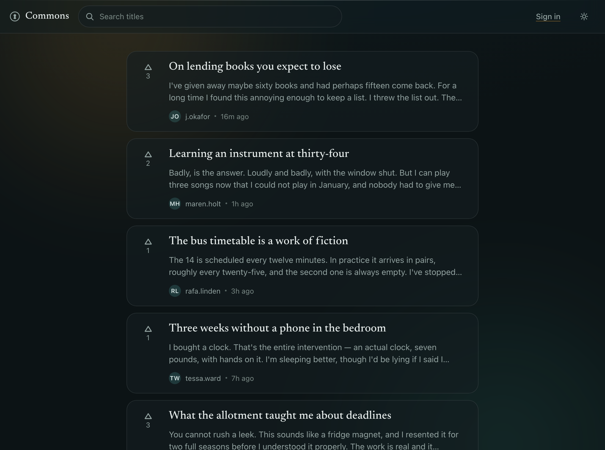
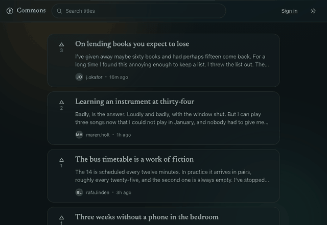
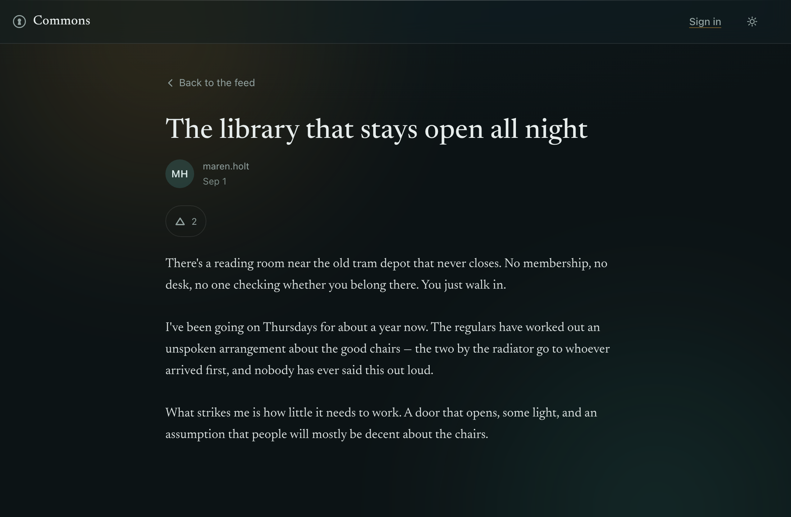
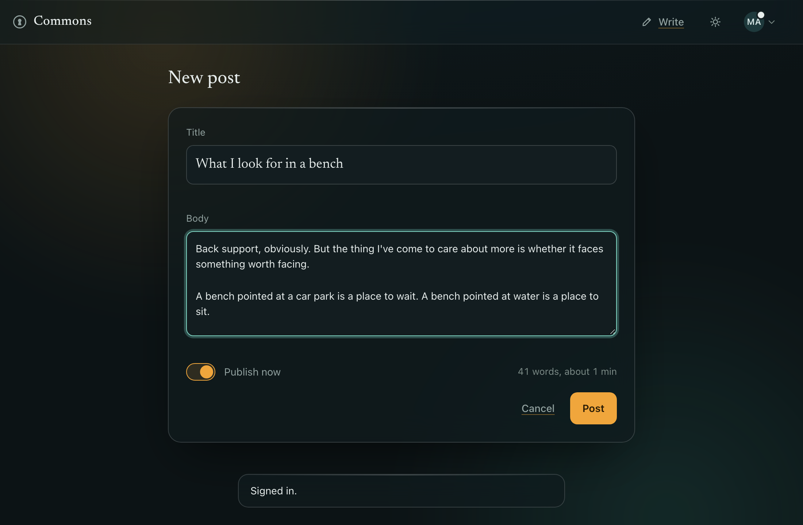
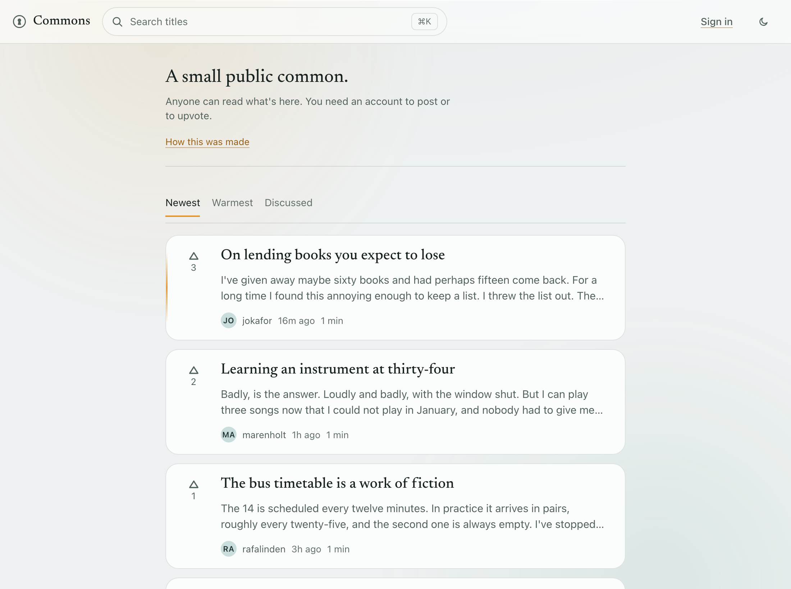
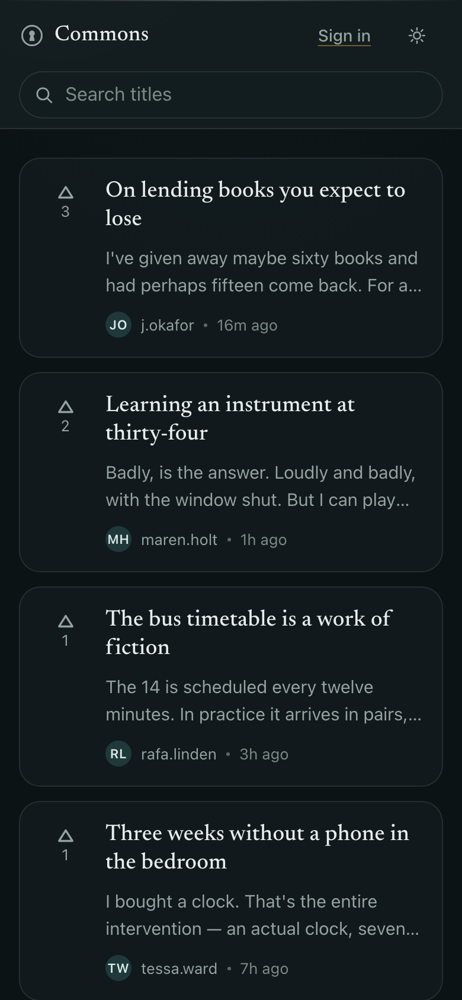
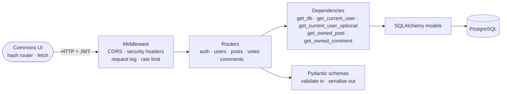

<h1 align="center">Commons</h1>

<p align="center">
  A small public common. Anyone can read the feed; you need an account to post or upvote.
</p>

<p align="center">
  <a href="https://andrewtechtips.github.io/social-feed-application/"><strong>Live demo</strong></a>
  ·
  <a href="#running-it">Run it locally</a>
  ·
  <a href="#decisions-i-made">Decisions I made</a>
</p>

<p align="center">
  <a href="https://github.com/AndrewTechTips/social-feed-application/actions/workflows/build-deploy.yml">
    
  </a>
  
  <a href="LICENSE"></a>
</p>

<p align="center">
  
</p>

A full-stack social feed: **FastAPI + PostgreSQL** behind a **hand-written, no-build
frontend**. Register, publish posts, upvote other people's, search and page through the
feed. Reading is public; writing needs a token.

| | |
| --- | --- |
| **Backend** | FastAPI · SQLAlchemy 2.0 · PostgreSQL 17 · Alembic · JWT + bcrypt · slowapi |
| **Frontend** | Plain HTML, CSS and ES modules. No framework, no bundler, no build step — type-checked anyway, with JSDoc and `tsc --noEmit`. |
| **Tested** | 231 pytest tests (97% coverage) · 338 Playwright end-to-end tests, run against two API implementations · axe on every screen |
| **Checked** | `black` · `mypy --strict` · `pip-audit` · `alembic check` · Lighthouse CI |
| **Shipped** | Docker · GitHub Actions → Docker Hub · GitHub Pages |

---

## A look at it

<p align="center">
  
</p>

<table>
<tr>
<td width="50%"><br /><sub>Post detail — content is set in a serif, the interface isn't.</sub></td>
<td width="50%"><br /><sub>Compose, with the publish toggle and a character count.</sub></td>
</tr>
<tr>
<td><br /><sub>Light theme — a cool off-white, never cream.</sub></td>
<td align="center"><br /><sub>390px. The header collapses to two rows.</sub></td>
</tr>
</table>

<sub>Every image here is a real capture of the running app —
see <a href="docs/README-capture.md">docs/README-capture.md</a> to regenerate them.</sub>

---

## About that live demo

The link at the top is hosted on GitHub Pages, which serves static files and
nothing else — there is nowhere for FastAPI to run. So rather than publish a link
that opens on *"Can't reach the server"*, the published build answers its own
requests: [`frontend/js/demo/backend.js`](frontend/js/demo/backend.js)
reimplements the API in the browser, against
[a seeded feed](frontend/js/demo/seed.json) of real posts. It says so on the
page, and it says so on every visit.

Everything works — post, upvote, edit, delete, search, paginate, drafts staying
private, sessions that survive a reload and sign out properly. Changes are kept in
`localStorage`, so they survive a refresh and reach nobody else; **Reset the demo** puts
it back.

One thing it can't have, and doesn't pretend to: the real API keeps its refresh token in
an `httpOnly` cookie, and there is no server here to set one — the "backend" is
JavaScript in the same window as the app, so there is nothing an `httpOnly` flag could
hide a value *from*. The demo implements the same contract (rotation, reuse detection,
the lot) and keeps the token in the same `localStorage` blob as everything else. The
cookie and its flags are exercised against `mock_api.py`, which is a real HTTP server on
a real origin.

What makes it more than a mock: the end-to-end suite runs **the same specs
against both** the demo adapter and `mock_api.py`, so the site people click and
the API this project ships can't quietly drift apart. `?demo=1` turns it on
locally against the real files:

```bash
cd frontend && python3 -m http.server 5173
open "http://localhost:5173/?demo=1"
```

---

## Running it

### Docker — nothing to install but Docker

```bash
cp backend/.env.example .env      # then edit the values
docker compose up --build
```

API on <http://localhost:8000>, interactive docs on <http://localhost:8000/docs>.

### Or locally, with your own Postgres

```bash
python -m venv .venv && source .venv/bin/activate
pip install -r backend/requirements-dev.txt
cp backend/.env.example .env      # point it at your Postgres

# create the databases your config names (e.g. social_feed + social_feed_test)
alembic -c backend/alembic.ini upgrade head
uvicorn backend.app.main:app --reload
```

### The web UI

```bash
cd frontend && python3 -m http.server 5173
```

Open <http://localhost:5173> — the origin the API's CORS config allows. That's the whole
build step. `API_BASE` lives in `frontend/js/config.js`; if you serve the app somewhere
else, add that exact origin to `origins` in `backend/app/main.py`.

---

## How it fits together



A request goes **middleware → router → dependencies (session, auth, ownership) →
SQLAlchemy → PostgreSQL**, with Pydantic validating the body on the way in and shaping
the response on the way out.

```
backend/
  app/
    main.py            app setup, middleware, exception handlers, /healthz
    config.py          env-driven settings (pydantic-settings)
    database.py        engine + pooled session, get_db dependency
    models.py          ORM tables: Post, User, Vote, Comment
    schemas.py         request/response models
    oauth2.py          JWT create/verify, get_current_user(_optional)
    limiter.py         shared slowapi limiter
    logging_config.py  dictConfig setup
    routers/           auth.py · user.py · post.py · vote.py · comment.py
  alembic/             migrations
  tests/               pytest suite + fixtures
  scripts/             coverage_badge.py
frontend/
  index.html           shell: header, <main> mount, aria-live toasts, theme bootstrap
  styles/              tokens.css · base.css · components.css · views.css
  js/
    config.js          picks the API: the real one, or the in-browser demo
    api.js             fetch wrapper — auth header, JSON, error normalisation, 401/403/429
    store.js           tiny reactive store: session, feed cache, local vote mirror
    router.js          hash router with :params and a ?query
    ui.js              h() builder, toasts, relative time, avatars, skeletons, vote control
    views/             feed.js · post.js · profile.js · auth.js · compose.js
    components/        palette.js — the ⌘K command palette
    actions.js         the few things both the header and the palette can do
    transitions.js     the card-title → post-title view transition
    demo/              backend.js (the API, in the browser) · seed.json · strip.js
    main.js            boot: header, theme toggle, search wiring, routes
  assets/              one subset variable font, one SVG icon sprite
  tests/               Playwright specs, a stdlib mock backend, and the fixtures
                       that point the suite at either API
docs/                  screenshots, and the scripts that regenerate them
```

### Screens

One page, hash routes.

| Route | Screen |
| --- | --- |
| `#/` | Feed (public). Opens with a masthead for anyone not signed in — a line of type saying what this is, and in demo mode the notice too. Debounced search drives `?search=`, and a result shows the sentence it matched on with the matching words marked rather than the post's opening 280 characters; infinite scroll with a visible end state; skeletons while loading. Three orderings — newest, warmest and discussed, the last two decaying rankings. While you are reading it, the feed asks every forty-five seconds whether anything has arrived and offers it as a pill rather than moving the page under you. A returning reader also gets a count of what arrived while they were away and a rule through the list marking where they left off; cards they have opened draw their title dimmed, and every card says how long it is. |
| `#/posts/:id` | Post detail (public). Full text, timestamps, "edited" when changed, vote control, Save to the shelf, a reading panel (three text sizes and focus mode, `f`), Edit/Delete if it's yours with an inline confirm. Select a passage with a mouse and it offers to copy it with a link back. `Ctrl+P` prints it as a page from a book. At the end, two links into the list you arrived from — `j` and `k` follow them. The byline links to the author. Below it, the conversation: an inline composer, comments oldest first, appended optimistically and rolled back with a toast if the write fails. You can reply to a comment — one level, declared in the API's own schema rather than only checked in a handler — and a conversation is never split across a page boundary, because the page is over conversations and replies come with their parent. |
| `#/u/:username` | Everything one person has written — the feed's cards and rules with a single author, including their drafts staying theirs. |
| `#/login`, `#/register` | Inline field errors, one friendly line on failure, submit disabled while pending. Registering asks for a username, an email and a password; a taken username and a taken email are told apart. Register signs you in, so you land on the feed ready to post. |
| `#/colophon` | How this was made, inside the thing it describes: the stack in prose, the repository's own measurements, four decisions linked to their records, what's honest about the demo, and a button that opens the palette rather than printing a list of shortcuts that could go wrong. Offered from the masthead and from ⌘K. |
| `#/shelf` | What you've put aside, newest save first. The feed's column and cards with your saves in it. Saved posts are ids in this browser — the screen asks the API for each one, so a post that has been deleted drops off the shelf rather than sitting there pointing at nothing. |
| `#/settings` | Your account: change the name everybody sees, sign out on every device, or delete the account. Renaming keeps your posts, comments and votes, because they were joined to your account rather than to your name. Your email is shown and cannot be changed here — moving an account to a new address means sending a confirmation to it, and this app has no way to send mail, so it says so rather than offering a box that half-works. Deleting asks you to type your own username and takes everything with it. Offered from your own profile and from ⌘K. |
| `#/compose`, `#/posts/:id/edit` | Title, body, publish toggle, and a count that reads the post back in the terms the card will use — *312 words, about 2 min*, from the same function the card calls. The character count appears only within four hundred characters of the limit. A new post is kept as you type, so a mistyped address doesn't take it with it: come back and the form is as you left it, with a way to start fresh. `POST` to create; `PATCH` with only the changed fields to edit. |

### The API

The generated spec is committed at [`docs/openapi.json`](docs/openapi.json) — worked
examples, documented error responses and all — so the contract can be read, diffed or fed
to a client generator without running anything. CI fails if it drifts from the code.

| Method | Path | Auth | Notes |
| --- | --- | --- | --- |
| `POST` | `/users/` | – | register — username, email, password (8–72 bytes), 10/hour |
| `POST` | `/login` | – | form login (by **email**) → `{access_token, expires_in, csrf_token}` plus an `httpOnly` refresh cookie, 5/min |
| `POST` | `/auth/refresh` | cookie | trade the refresh cookie for a new access token, rotating both. Needs `X-CSRF-Token`. 30/min |
| `POST` | `/auth/logout` | cookie | revoke the session and clear the cookie. Needs `X-CSRF-Token` |
| `POST` | `/auth/logout-all` | bearer | revoke **every** session for the account. Takes the access token rather than the cookie: holding a cookie ends the session it belongs to, ending everyone else's should take more |
| `GET` | `/posts/` | optional | paginated feed: `?page=&page_size=&search=` — full-text search over title and body, drafts only if they're yours |
| `GET` | `/posts/{id}` | optional | one post + vote count |
| `POST` | `/posts/` | bearer | create |
| `PUT` | `/posts/{id}` | bearer | full replace (author only) |
| `PATCH` | `/posts/{id}` | bearer | partial update (author only) |
| `DELETE` | `/posts/{id}` | bearer | author only — cascades to its votes and comments |
| `GET` | `/posts/{id}/comments` | optional | a post's comments, oldest first, paginated — 404 if the post isn't yours to see |
| `POST` | `/posts/{id}/comments` | bearer | say something (1–2000 characters, trimmed) |
| `DELETE` | `/comments/{id}` | bearer | whoever wrote it, and nobody else |
| `POST` | `/vote/` | bearer | `{post_id, dir}` — `dir` 1 = up, 0 = remove |
| `GET` | `/users/me` | bearer | who the caller is — `{id, username, email}` |
| `PATCH` | `/users/me` | bearer | change your username — and only that. 409 if it's taken; your own name back is a no-op, not a collision |
| `DELETE` | `/users/me` | bearer | delete the account. One `DELETE`; the schema's cascades take the posts, the comments under them, the comments left elsewhere, the replies to those, the votes and the sessions |
| `GET` | `/users/{username}` | – | a public profile: no email, ever |
| `GET` | `/users/{username}/posts` | optional | everything by one person, paginated like the feed |
| `GET` | `/healthz` | – | liveness probe |

---

## Tests

```bash
cd backend && pytest -q          # 231 tests, coverage gate at 85%
cd frontend && npm test          # 338 Playwright tests, no Postgres needed
cd frontend && npm run typecheck # tsc --noEmit over the JSDoc types
cd frontend && npm run lighthouse           # desktop, the floors CI gates on
cd frontend && npm run lighthouse -- --mobile
```

Node 22 or newer, and `frontend/.nvmrc` pins the version CI uses — worth respecting,
because a lockfile written by a newer npm than the one installing from it is a failure
that only shows up on CI ([ADR 0006](docs/adr/0006-lighthouse-without-lhci.md)).

The backend suite needs a reachable Postgres and a `<DATABASE_NAME>_test` database; it
creates and drops the tables itself on every test.

The frontend suite runs twice, against both implementations of the API: the
standard-library `frontend/tests/mock_api.py`, and the in-browser adapter the
published site uses. Neither needs Postgres, so it's hermetic and fast. First
time:

```bash
cd frontend && npm install && npx playwright install chromium
```

| Spec | Covers |
| --- | --- |
| `e2e.spec.js` | The whole journey: register → sign in → create → upvote and un-upvote → edit → delete (inline confirm, Escape to cancel) → sign out. Plus pagination on scroll and search. |
| `drafts.spec.js` | A draft is visible to its author and to nobody else, in the feed and by direct URL, and publishing puts it back in everyone's feed. |
| `errors.spec.js` | Wrong password, duplicate email, editing someone else's post, empty fields, backend unreachable. |
| `responsive.spec.js` | No horizontal overflow at 320–1280, the header collapse, ≥44px tap targets, the reading column staying narrow. |
| `palette.spec.js` | ⌘K: one flat list, a key on every row, filtering the loaded feed without touching the network, each of the five actions, and the shortcuts working outside the palette but staying out of the way while you type. |
| `transitions.spec.js` | The title morph both ways, the name being released afterwards, reduced motion starting no transition at all, a browser without the API still navigating, and the per-card stagger staying gone. |
| `identity.spec.js` | Registering with a username, a taken name named as the problem, no address anywhere on screen, profiles listing only that person's posts (and keeping their drafts), and — the one that matters — signing in on a browser with no local history and still seeing Edit only on your own posts. |
| `masthead.spec.js` | Shown to strangers, gone once signed in, out of the way while searching, and — in demo mode — carrying the notice so it's said once rather than twice. |
| `comments.spec.js` | Saying something and seeing it before the server answers, getting your words back when the write fails, removing your own and only your own (not even as the author of the post), a draft having no conversation to read or join, and a deleted post taking its comments with it. |
| `unread.spec.js` | What the app remembers: the count of posts since your last visit and where the rule lands, a refresh not counting as leaving, being away long enough that it does, a post read only after two seconds of being looked at, a mis-tap not counting, and the whole lot scanned by axe in both themes and measured at 320px. |
| `votes.spec.js` | That a vote survives a reload with nothing in storage to remember it, that a signed-out visitor sees the count without a pressed caret, that somebody else's vote isn't yours, that a vote cast on a post is still there when you go back to the cached feed, and that a refused vote puts every copy back. |
| `anchor.spec.js` | That a post written while you scroll doesn't hand you a card you've already read, that the anchor is sent on the pages after the first and not on the first, that searching isn't anchored, and that it survives a cache restore. Each one fails with `as_of` removed — a test that passes either way is worth nothing. |
| `sort.spec.js` | The three orderings and that the marked one is the one you're on, that a ranking is a different list from newest, that `discussed` answers a different question from `warmest`, that each ordering is cached separately — and the two pieces of furniture a ranking has to switch off, because both assume the list is in time order. |
| `comments.spec.js` (replies) | A reply landing under what it answers and surviving a reload, a reply having no Reply of its own, the heading counting messages rather than conversations, removing a conversation taking what was said back to it, one reply box open at a time, and nothing offered to a signed-out reader. |
| `live.spec.js` | The count being right and singular at one, the posts being offered rather than forced, the pages below not renumbering when they are taken, the pill staying away from a ranking and a search, what it brought in joining the list the post screen reads on from, and the poll stopping when you leave the feed — with a positive control, because a poll that never happened and a poll that was stopped look identical. |
| `search.spec.js` (excerpts) | That a result shows the sentence it matched on, that the mark follows the stem rather than the letters, that there is no excerpt without a question — and the one that matters: that the excerpt is never parsed as markup. Swap the splitting for `innerHTML` and that last one fails in both projects with an `` on the page. |
| `onward.spec.js` | The two links at the end of a post: which list they mean, the first and last of it having only one, two steps in a row still working, `j`/`k` following them and staying out of a comment box, and the morph name being handed on rather than shared. |
| `shelf.spec.js` | Saving and unsaving, the header link appearing with the first save and going with the last, surviving a reload without an account, newest save first, a deleted post dropping off, one missing id not taking the page with it, and the signed-in header still fitting at 320px. |
| `offline.spec.js` | The worker registering at the app's own scope, the API never reaching its cache, the shell list still matching what's on disk, and — in demo mode — the whole app opening with the network switched off. |
| `colophon.spec.js` | That every figure on the page is one from the committed measurement and nothing was typed in, that every decision it names links to a record that is actually on disk, that it still reads as a page when the measurement can't be fetched, and that the outward links carry `rel=noopener`. |
| `reader.spec.js` | The panel opening, the text size changing the post and nothing else and surviving a reload, focus mode clearing the page and leaving one way out and not following you off it, the panel's own radios not switching the single-key shortcuts off, and a printed post being ink on paper rather than white on white. |
| `quote.spec.js` | A selected passage offering to be copied with its title and address, where the control sits, what is too short to be a quote, and the control not existing at all on a touch screen. |
| `demo-seed.spec.js` | Demo mode only: the published site opens on the seeded feed, paginates to the end, says what it is on every visit, keeps a seeded draft private to its author, opens the long post on a real thread, and survives a refresh — then forgets everything on **Reset the demo**. |
| `mobile.spec.js` | The phone-only regressions: transparent tap highlight, ≥16px form controls at every width *and* in landscape, `:active` feedback under a real tap gesture, hover states behind `(hover: hover)`, no overflow at 320–414 while signed in, and source guards against bare `100vh` coming back. |
| `search.spec.js` | A word that's only in the body, any form of a word finding every other form, a title match ranking above a body match, two words narrowing rather than widening, `%` as a character rather than a wildcard, and a draft never turning up in someone else's results. |
| `a11y.spec.js` | axe (WCAG 2.1 A + AA) on every screen there is — feed, empty feed, post, sign in, register, a form mid-error, compose, edit, profile, owner controls, the delete confirm, a comment thread and the palette — plus one journey through the whole core flow without a mouse. |

CI runs both suites on every push, checks `black`, verifies the migrations apply to an
empty database *and* still match the models (`alembic check`), and only publishes an
image once all of that is green.

> **If port 8000 is busy** (the real backend is running, say): point the app at a free
> port by editing `js/config.js`, then `API_PORT=8010 npm test` to match.

---

## Decisions I made

The ones that shaped the shape of the thing have their own records in
[`docs/adr/`](docs/adr/) — each says what it costs and what would change my
mind, which is the part that makes it a decision rather than a preference:

| # | Decision | The short version |
| --- | --- | --- |
| [0001](docs/adr/0001-vanilla-js-with-jsdoc-types.md) | Vanilla JS with JSDoc types, not TypeScript | Type checking is worth having; a build step isn't worth what it costs here. Revisit at ~3,000 lines or a second contributor. |
| [0002](docs/adr/0002-hash-routing.md) | Hash routing, not the History API | There is no server to answer `/posts/12`. Ugly URLs, zero Pages configuration. |
| [0003](docs/adr/0003-token-in-an-httponly-cookie.md) | The refresh token lives in an `httpOnly` cookie | Short access token in memory, long refresh token the page can't read. Supersedes the `localStorage` decision, which said to revisit exactly when this landed. |
| [0004](docs/adr/0004-demo-mode-for-a-static-host.md) | Demo mode is the answer to a static host | Three implementations of one contract, held together by running the same suite against all of them. |
| [0005](docs/adr/0005-offset-pagination.md) | Offset pagination | It matches the UI and the index. Switch to keyset at ~50k posts, and here's the exact change. |
| [0006](docs/adr/0006-lighthouse-without-lhci.md) | Lighthouse runs from a script, not `@lhci/cli` | Sixty lines replaced 331 packages and all ten `npm audit` findings — and fixed an `npm ci` that only failed on CI. |
| [0007](docs/adr/0007-a-network-first-service-worker.md) | The service worker is network-first | Precaches the shell, then serves the network and falls back to the cache. Cache-first assumes content-hashed filenames, which a project with no build step doesn't have — so the version constant nobody remembers to bump would be the only thing between a reader and a permanently stale app. |
| [0008](docs/adr/0008-a-ranking-with-two-gravities.md) | A ranking with two gravities | `warm` decays at 0.5 and `discussed` at 0.25, both chosen by measuring against the seeded feed rather than by copying Hacker News — at its 1.8, "warmest" on a feed this quiet collapses into "newest with the unvoted posts pushed to the bottom". A vote is a reaction and it stales; a conversation is a thing you can still join. |
| [0005 amendment](docs/adr/0005-offset-pagination.md) | A third trigger, and `as_of` instead of keyset | The original triggers were about volume. A feed that *receives* rows while it is read duplicates a card per row inserted at any write rate, which one `created_at <= :as_of` closes — and keyset is still the answer to depth, not to this. |

And the smaller ones, in place:

**The username is the public identity; the email is a credential.** A post used
to carry its author's address, so anyone who could read the feed could collect them
— and `GET /users/{id}` handed out the rest to anyone who could count. Now people
have usernames (3–20 characters, letters, digits, `-` and `_`, starting with a
letter, stored folded so a plain `UNIQUE` is also case-insensitive) and `UserOut`
has no email in it at all.

**Which meant something had to answer "who am I?".** Logging in takes an email and
a password and hands back a token, and a token says nothing about the person it
signed in. That was survivable while the feed carried addresses to match against;
once it didn't, a browser with no local history could sign in successfully and
still not know which posts were its own. `GET /users/me` closes it: the client
asks straight after login and keeps `{id, username}` in the session. Ownership is
decided by id — the one thing about a person that doesn't change.

**Drafts are an access rule, not a display hint.** The feed used to filter on the search
term and nothing else, which meant an unpublished post was served to everybody while the
UI cheerfully labelled it "Draft". `GET /posts/` and `GET /posts/{id}` now apply
"published, or yours", via an *optional* auth dependency — the feed has to stay readable
without a token, so a bad token makes you anonymous rather than making the page a 401.
Someone else's draft answers 404, not 403: a 403 would confirm it exists.

**Login takes the same time whether or not the email exists.** A missing user used to
return before any hashing happened, while a wrong password paid for a full bcrypt round —
about 100 ms of difference that told you which addresses had accounts, whatever the
response body said. The miss path now verifies against a fixed dummy hash.

**The database has indexes that match the one hot query.** The feed filters on
`published` and sorts by `created_at`, so those share a composite index and the planner
does an index scan backwards instead of sorting the table. Counting votes per post gets
its own index, because the `votes` primary key leads with `user_id` and can't answer that
question.

**One font, split by job.** Newsreader — a subset variable woff2, ~120 KB, preloaded —
carries every piece of *content*. The interface chrome uses the system sans stack. That
split is the identity: a quiet lamplit reading room, not a dashboard.

**The title travels.** Tap a post and its heading moves from the card to the top of
the screen, rather than one screen fading into another — the same idea as an iOS push,
or Things 3, where the thing you touched becomes the thing you're looking at. It's built
on the View Transitions API, feature-detected, and it replaced a staggered fade-up that
played on every card: that fired on pagination and on cache restore too, where nothing
had actually arrived. Motion should answer an action, not perform on arrival.

It's kept short (160ms for the page, 240ms for the title) for a reason that isn't
taste — while a view transition runs, the browser shows snapshots and the document
doesn't take input. The duration is also how long the app ignores a tap.

**The vote is the only other thing that pops.** One spring, one colour shift, and a shape
change (outline caret → filled) so it never depends on colour alone. Everything else
stays still.

**⌘K opens a command palette.** One flat list — Raycast's discipline, no categories — and
every row shows the key that runs it, which is Linear's habit and the reason the palette
makes itself unnecessary. That only works if the keys are real, so `N`, `T`, `G` and `C`
work on their own outside it. It searches the posts already on screen, so filtering never
touches the network, and it does five things and stops.

**Optimistic voting, pessimistic writes.** Votes update immediately and roll back on a
real error; 409 and 404 are treated as "you're already in the state you wanted". Create,
edit and delete wait for the server.

**The feed cache is keyed on who it was fetched for.** Leaving the feed snapshots its
items and scroll position for 60 seconds so coming back is instant. Because you see your
own drafts and nobody else does, that snapshot records the viewer it was fetched *for* —
otherwise signing out re-renders the same route, and the outgoing screen's teardown
writes the signed-in list back into the cache one line before it's read.

**Two tokens, and the one that matters can't be read by JavaScript.** A 15-minute
access token lives in a variable and goes out as a Bearer header; a 14-day refresh token
lives in an `httpOnly`, `SameSite=Lax` cookie scoped to `/auth`, so no content route ever
sees it and no script can copy it. An XSS bug can act as you while the tab is open and
can't walk away with the session — which was the stated cost of the decision this
replaced, closed rather than restated. Refreshing rotates the cookie (with a 15-second
grace window, or opening a second tab would look like a stolen cookie and sign you out of
both), and signing out revokes it server-side rather than only forgetting it here.
`localStorage` still holds `{id, username}` and a CSRF nonce: both public, neither a
credential. The full argument, including the trap where serving the frontend from
`127.0.0.1` instead of `localhost` makes the cookie silently vanish, is in
[ADR 0003](docs/adr/0003-token-in-an-httponly-cookie.md).

**The demo doesn't get the cookie, and says so.** There is no server on the published
site, so there is nothing an `httpOnly` flag could hide a value from — the "backend" is
JavaScript in the same window. Demo mode implements the same contract, rotation and reuse
detection included, and keeps the refresh token in its own `localStorage` blob. The
end-to-end suite's mock is a real HTTP server on a real origin, which is where the cookie
and its flags are actually exercised.

**Signup tells you an email is taken.** That does let someone enumerate addresses. The
usual fix is to answer 201 either way and send the "you already have an account" note by
email, which needs mail this project doesn't have; the 10/hour limit is the compensating
control.

**The vote control used to guess.** The API had no way of saying whether *you* had
voted, so the frontend kept a set of post ids in `localStorage` and read the caret off
that — which meant your own votes were invisible on a second device, invisible in a
private window, and wrong after clearing site data. `PostOut` carries `voted` now,
answered per reader: the count is the room's and the flag is yours, so the same row
comes back differently for two people. On the feed it costs nothing — the query already
outer-joins every vote in order to count them, so "did this reader vote" is a second
aggregate (`bool_or`) over rows that were read anyway. The old `commons.votes` key is
removed on boot rather than merely unused: a guess about somebody's voting, left in
their browser, is still a record of it.

**What you've saved never leaves your browser either**, for the same reasons —
`commons.shelf` is a list of post ids, nothing more. Ids rather than copies of
the posts: a saved snapshot would render instantly and would then be wrong in
every way a post can change, whereas an id costs a request and is never
describing something that isn't there. A post that has been deleted answers 404
and comes off the shelf as it's discovered.

**The numbers on the colophon are measured, not typed.** `docs/stats.py` counts
the repository into [`frontend/stats.json`](frontend/stats.json) — lines, modules,
runtime dependencies, both test counts, coverage read back off the committed
badge, decision records — and CI re-checks it. It has to be checked from two
jobs, because the backend test count needs pytest and the end-to-end count needs
a Playwright install and no runner has both; each job verifies what it can
measure and says which those were, so between them every field is covered.

```bash
python docs/stats.py            # re-measure
python docs/stats.py --check    # what CI runs
```

**The app works offline, and installs.** A network-first service worker
([ADR 0007](docs/adr/0007-a-network-first-service-worker.md)) precaches the
shell and answers from it when there's no network. On the published build that
means the whole app — the files from the cache, the data from `localStorage`,
the API from a module that was itself served from the cache. Network-first
rather than cache-first because there's no build step here and therefore no
content-hashed filenames, so cache-first would put a version constant between
readers and every future change.

**What you've read never leaves your browser.** `commons.read` and `commons.visit` are two
keys in `localStorage`, read once at boot by `frontend/js/reading.js`; there is no endpoint
behind them, no column in the database and nothing for the demo adapter to implement. A
record of what somebody has read is the most revealing thing a reading app could hold, and
the honest place for it is the machine doing the reading. The cost is that it doesn't
follow you to another device, which is said here rather than papered over.

It is keyed to the browser and not to the account, deliberately: a read set per user id
loses your history at the moment it matters most — you read half the feed signed out, sign
in, and everything you just read is unread again. On a shared machine the next person
arrives at a feed already part-dimmed, which is a small and self-correcting wrong against
losing the feature for everyone who signs in halfway through.

**"Since you were last here" survives a refresh.** Reloading writes "you were last here a
moment ago" on the way out, so a single timestamp would have thrown the count away before
the reader had done anything about it. Anything inside thirty minutes is the same visit
carrying on and the mark is carried across unchanged; past it, the reader has genuinely
been away and where they got to becomes the new mark.

<details>
<summary><strong>The design system, in full</strong></summary>

Everything lives in `frontend/styles/tokens.css` as custom properties.

| Group | Values |
| --- | --- |
| **Type** | `--font-serif` Newsreader (variable, opsz 6–72) for brand, titles, post body, headings, empty states. `--font-ui` system sans for everything interactive. Scale: `--fs-brand` 1.15rem · `--fs-h1` clamp(1.7→2.4rem) · `--fs-title` 1.3rem · `--fs-read` 1.125rem · `--fs-ui` .875rem · `--fs-meta` .8125rem. Reading measure `--measure: 66ch`, tightening to 58ch in focus mode. `--fs-read` has three steps a reader can pick between — 16, 18 and 21px — set as `data-text-size` on `<html>` by the same pre-paint inline script that sets the theme. Form controls use `--fs-field`, which is `--fs-ui` on the desktop and exactly 16px on anything touch-shaped. |
| **Colour (dark)** | `--bg #0c1315` deep teal-ink · `--card-bg` translucent `#131d20` · `--text #e7edec` / `--text-dim #93a3a1` / `--text-faint #7c8b87` · one accent, `--accent #f0a63c` honey amber, used only for live things (your identity, an active upvote, links) · `--danger #e8705d` coral · `--focus #7fd6c4` teal — deliberately *not* the accent, so focus always reads. |
| **Colour (light)** | Cool off-white `--bg #eef1f1` (not warm cream), `--accent #e2952f`, `--link #9a5f12`, `--focus #1f8a76`. The toggle persists to `commons.theme` and defaults to `prefers-color-scheme` via a pre-paint inline script. |
| **Space** | 8px rhythm: `--s-1`…`--s-9` = 4, 8, 12, 16, 24, 32, 48, 64, 96. |
| **Radius** | Varies by role on purpose: cards `--r-lg` 18px, inputs and buttons `--r-sm` 10px, pills 999px. |
| **Glass** | `--blur` 14px / `--blur-strong` 20px, `--saturate` 1.6, on four surfaces only: the header, the compose panel, the delete confirm, and a card on hover. Hairline gradient top border, soft large-radius shadow. `@supports not (backdrop-filter)` falls back to solid — and below 640px the blur is dropped entirely in favour of those same fallbacks. |
| **Motion** | `--t-fast/mid/slow` 120/200/320ms, `--ease` `cubic-bezier(.2,.7,.2,1)`. Two things move on purpose — the title travelling from card to post, and the spring pop on the vote. Everything else is feedback, not animation: hover lift, button press scale, skeleton shimmer, and a cross-fade for browsers without View Transitions. `transform` and `opacity` only. `prefers-reduced-motion` cuts all of it, the view transition included. |
| **Background** | Two slow, very faint amber and teal blooms behind everything. They never compete with text, shrink to one static bloom below 640px, and stop entirely under reduced motion. |

**Voice.** Understated and warm. Short sentences, contractions, no hype. *"Nothing here
yet. Be the first to say something."* / *"That's everything for now."* / *"Delete this
post? There's no undo."*

**Accessibility.** Semantic landmarks, labelled inputs, `aria-live` toasts, focus moves to
the new screen on route change (but not away from the search field while you're typing),
Escape closes the delete confirm and returns focus to the trigger, visible restyled focus
rings, AA contrast throughout.

**Icons** are an SVG `<use>` sprite, not a font — one cached request.

</details>

<details>
<summary><strong>What making it work on a phone actually took</strong></summary>

The layout was responsive from the start. These are the things that only showed up on a
real handset.

**The blue tap flash.** Nothing overrode `-webkit-tap-highlight-color`, so every tap on a
link, button or card flashed the browser default — `rgba(51, 181, 229, .4)` — over it.
It's now `transparent` on `html` (the property inherits, so that covers everything),
alongside `touch-action: manipulation` to drop the 300ms click delay.

Turning it off means the press feedback has to come from somewhere, and most of the
`:hover` rules were ungated: on a touch screen a tapped element keeps its hover skin until
you tap somewhere else. So every hover-only state now sits inside `@media (hover: hover)`,
and each tappable thing grew a matching `:active` rule. Worth knowing if you ever test
this by hand: `:active` is driven by the browser's *tap gesture*, not by raw touch events,
which is why `mobile.spec.js` drives it with `Input.synthesizeTapGesture` rather than a
synthetic `touchstart`.

**iOS zoom-on-focus.** `.input`, `.textarea` and `.search__input` were 14px. Below 16px,
mobile Safari zooms the page in when a field takes focus and never zooms back out — tap
the search box, lose the layout. Form controls now use `--fs-field`, which lifts to
exactly 16px under `@media (max-width: 640px), (pointer: coarse)`. Both halves earn their
keep: the width query covers narrow windows and device mode, and the pointer query covers
a phone in landscape, which is 900px+ wide on a modern handset and would sail straight
past a width-only rule.

**The signed-in header overflowed.** At 320px the labelled *Write* and *Sign out* buttons
pushed the theme toggle clean off the right edge, where it could not be tapped at all, and
took 49px of horizontal scroll with it. Below 640px both shed their words and become 44px
icon buttons — the accessible name comes from `aria-label`, so nothing is lost. The same
row broke again between about 640 and 900px: the header grid's middle track is now
`minmax(0, 1fr)` so the search yields instead of the row overflowing, and the account
email hides below 900px rather than 640px.

**Compose read as a squeezed desktop dialog.** On a phone it now drops the backdrop blur
and the 64px modal shadow, tightens its padding, and gives the body box
`max(9rem, 28dvh)` so there's somewhere to actually write.

**Glass was costing more than it was worth.** A `backdrop-filter` makes the browser
snapshot and blur everything behind the element on every frame it scrolls over; on a
weaker GPU that's what turns a sticky header into a smear. Below 640px the header, compose
panel and toasts use the opaque fallbacks that already existed for
`@supports not (backdrop-filter)`. The background blooms got the same treatment.

**Viewport and insets.** `viewport-fit=cover` was set, which means the page paints under
the status bar and home indicator — but nothing inset for them. The sticky header now pads
by `env(safe-area-inset-top)` and `#view` by `env(safe-area-inset-bottom)`. The header's
left/right insets were also transposed and are now the right way round. Heights that mean
"the visible viewport" use `dvh`, so nothing jumps as the URL bar slides in and out.

**Tap targets.** The brand, the *Back to the feed* link, the password reveal and the quiet
buttons were between 26 and 40px tall. They're 44px on a phone.

</details>

<details>
<summary><strong>Performance</strong></summary>

Measured **2026-09-15** with Lighthouse 13.4.1, against the demo build — the same
files GitHub Pages serves, through the same Chromium the test suite pins.
`npm run lighthouse` reproduces it; CI runs it on every push and fails below the
floors in [`frontend/tests/lighthouse.mjs`](frontend/tests/lighthouse.mjs).

| | Performance | Accessibility | Best practices | SEO |
| --- | --- | --- | --- | --- |
| **Desktop** (median of 3) | **100** | **100** | **100** | **100** |
| **Mobile** (Moto G Power, 4× CPU, slow 4G) | **97** | **100** | **100** | **100** |

Desktop: FCP 0.4 s, LCP 0.6 s, CLS 0, TBT 0 ms.
Mobile: FCP 1.5 s, LCP 2.4 s, CLS 0, TBT 0 ms. Reproduce it with
`npm run lighthouse -- --mobile`.

**Why mobile is 97 and not 100, honestly.** Lighthouse wants the CSS and JS
minified — it estimates about 19 KB across the two — which is fixable only with a
build step, the one thing this frontend is built not to have
([ADR 0001](docs/adr/0001-vanilla-js-with-jsdoc-types.md)). The comments in the CSS
are a meaningful part of what this repo is; shipping them costs three points on one
synthetic mobile run, and that is a trade I'd make again. TBT is 0 ms and CLS is 0,
which are the numbers a person actually feels.

No layout shift — skeletons match their final sizes, and off-screen cards use
`content-visibility` with a reserved `contain-intrinsic-size`. One preloaded font file,
no polling, no console output. Search debounced ~250ms with in-flight requests cancelled
through `AbortController`. Feed pages are appended with a `DocumentFragment`, never
rebuilt. About 41 KB of hand-written JS across 10 ES modules (~12 KB gzipped) and ~35 KB
of CSS, unminified — the comments stay.

</details>

---

## Migrations

```bash
# from the repo root
alembic -c backend/alembic.ini revision -m "describe change"   # after editing models.py
alembic -c backend/alembic.ini upgrade head
alembic -c backend/alembic.ini downgrade -1
alembic -c backend/alembic.ini check                           # models vs migrations
```

---

## How this project grew

It started as the freeCodeCamp *Python API Development* course, and then kept going. Each
of these was a deliberate pass over code that already worked:

- [x] Modernise to SQLAlchemy 2.0, Pydantic v2, PyJWT
- [x] 401 vs 403, password rules, structured logging, a global error handler
- [x] Rate limiting, a real connection pool, `/healthz`
- [x] Flat post schema, the N+1 fix, a public feed, pagination metadata, `PATCH` + `updated_at`
- [x] Split CI (test vs publish), migrations verified in CI, a slim non-root image
- [x] The frontend — plain HTML, CSS and vanilla JS, no build step
- [x] The mobile pass (see above), driven by real-device bugs
- [x] Drafts made private, the login timing oracle closed, indexes added, security headers
- [x] Playwright in CI, coverage gate, `alembic check`, Dependabot
- [x] A live demo that runs on a static host, with the suite run against it too
- [x] Usernames and profiles — the email stops being anyone's public name
- [x] Comments — a nested resource with its own ownership rule and real cascades
- [x] Postgres full-text search, and types without a build step
- [x] Decision records, a changelog, PWA and link-preview assets, Lighthouse in CI
- [x] Keyboard navigation, the warmth hairline, reading progress, refresh tokens, OpenAPI polish
- Not doing: follows (no social graph worth showing yet), a WebSocket live feed (nowhere
  in production to run it) — reasoning for both is in `UPGRADE_PLAN.md`

The longer version — what I'd change, what I'd skip, and why — is in
[`UPGRADE_PLAN.md`](UPGRADE_PLAN.md).

## License

[MIT](LICENSE).
